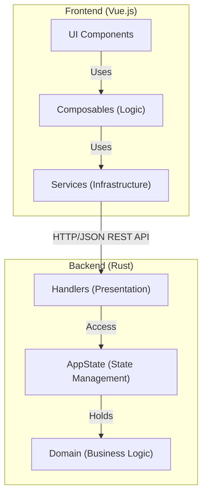
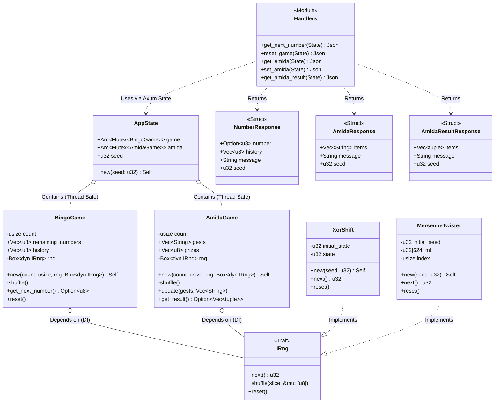
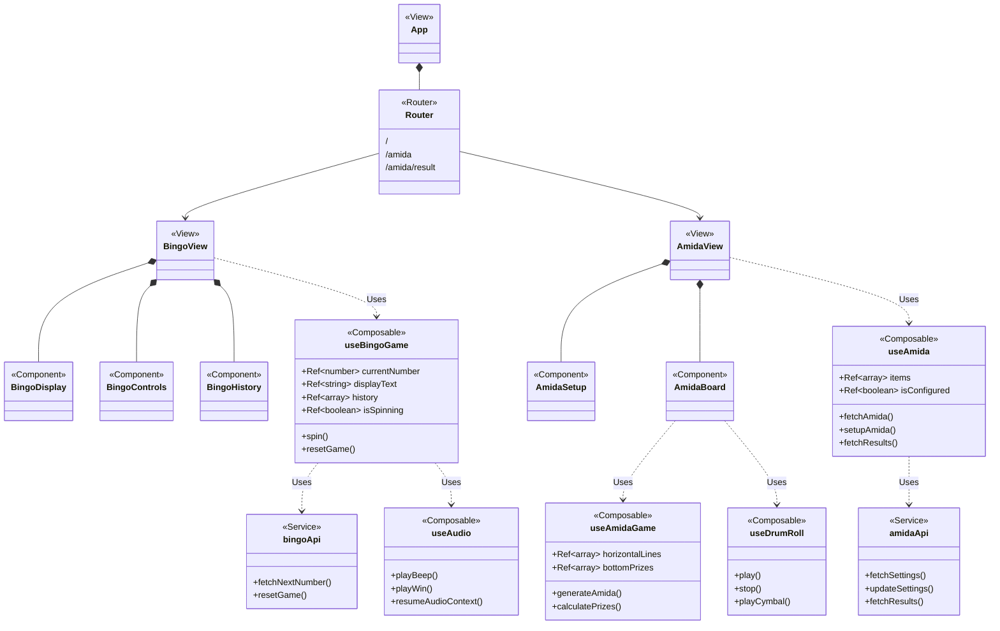
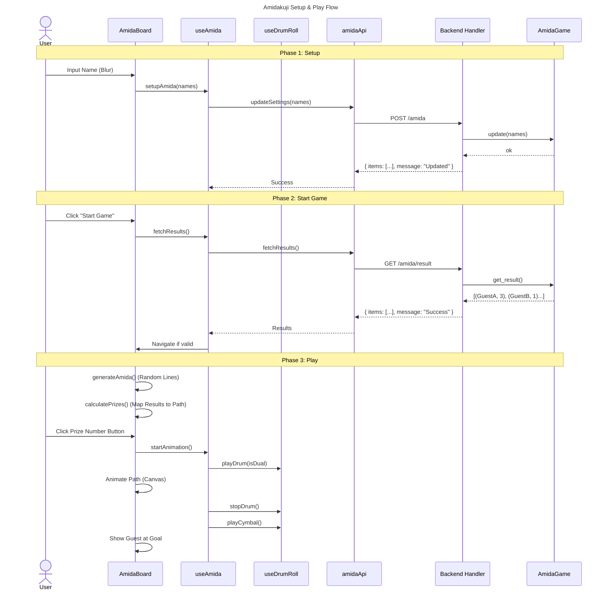

# アーキテクチャ設計書 (UML)

本ドキュメントでは、クリスマスビンゴシステムのアーキテクチャと設計をUML（Mermaid記法）を用いて可視化します。

## 1. システム全体構成 (コンポーネント図)

フロントエンドとバックエンドの疎結合な構成と、各層の依存関係を示します。

## 2. バックエンド詳細設計 (クラス図)

Rustバックエンドにおけるレイヤードアーキテクチャの実装詳細です。
`Handlers` は `AppState` を介して `BingoGame` ドメインオブジェクトにアクセスします。

## 3. バックエンド実装詳細

Rustバックエンドの主要な設計判断と実装パターンについて解説します。

### 3.1. 並行処理と状態管理 (Concurrency & State Management)

本システムは `Axum` (Webフレームワーク) と `Tokio` (非同期ランタイム) 上で動作します。
HTTPリクエストは非同期に並行処理されるため、アプリケーションの状態 (`AppState`) はスレッドセーフである必要があります。

*   **`Arc<Mutex<T>>` パターン**:
    *   `AppState` は `Arc` (Atomic Reference Counting) でラップされ、複数のスレッド（リクエストハンドラ）間で共有されます。
    *   内部の可変な状態 (`BingoGame`, `AmidaGame`) は `Mutex` で保護されています。
    *   ハンドラ内で `state.game.lock().unwrap()` を呼び出すことで、一時的に排他ロックを取得し、安全に状態を更新します。

### 3.2. 依存性の注入 (Dependency Injection)

テスト容易性と拡張性を高めるため、乱数生成器 (`IRng`) はトレイトとして定義され、ドメインロジック (`BingoGame`, `AmidaGame`) に注入されます。

*   **本番環境**: `XorShift` や `MersenneTwister` などの実装を使用。
*   **テスト環境**: 固定の値を返すモックや、特定のシードで初期化された乱数生成器を使用することで、決定論的なテストが可能になります。

### 3.3. エラーハンドリング方針

*   **パニック (Panic)**:
    *   `Mutex` のロック取得失敗時 (`.lock().unwrap()`) は、スレッドが汚染されている状態（Poisoned）を意味するため、パニックさせてリクエストを失敗させます（Axumが500エラーとして処理）。
    *   起動時の必須ファイル (`seeds.txt`) 読み込みエラーなどは、ログを出力してデフォルト値で続行するか、致命的な場合は停止します。
*   **Result型**:
    *   ドメインロジック内での期待されるエラー（例：あみだくじの参加者数が足りない）は `Option` や `Result` を返して呼び出し元に通知します。

## 4. フロントエンド詳細設計 (クラス図)

Vue.jsフロントエンドのコンポーネント構成とロジックの分離を示します。
`App.vue` が各コンポーネントを統合し、`useBingoGame` コンポーザブルがビジネスロジックを提供します。

## 4. 処理フロー (シーケンス図)

ユーザーが「SPIN」ボタンを押してから、抽選が行われ、結果が表示されるまでの時系列フローです。

## 5. あみだくじ処理フロー (シーケンス図)

あみだくじの設定から結果取得までのフローです。
結果（誰がどの番号になるか）はサーバーサイドで決定されます。

