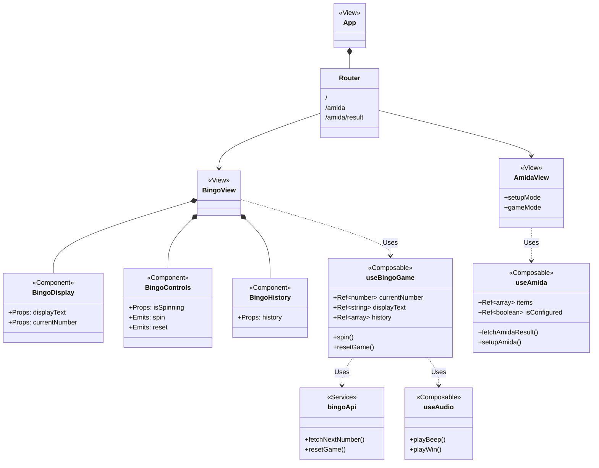
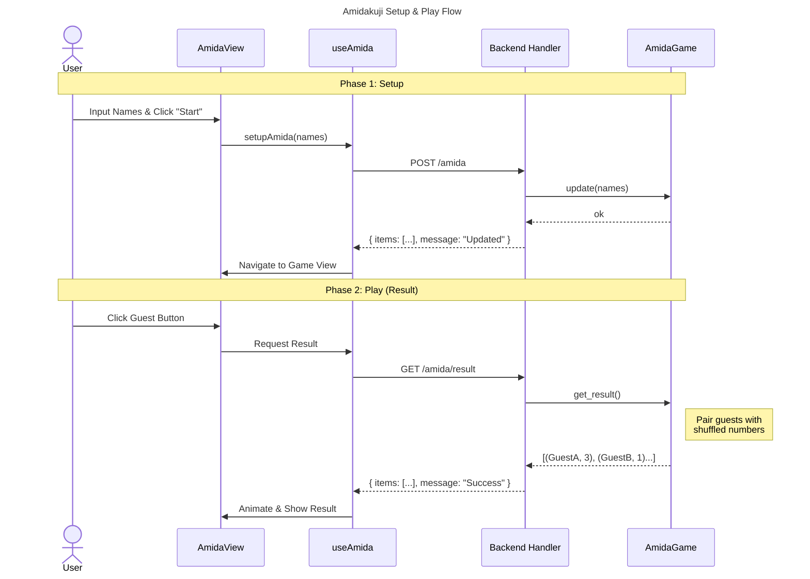

# アーキテクチャ設計書 (UML)

本ドキュメントでは、クリスマスビンゴシステムのアーキテクチャと設計をUML（Mermaid記法）を用いて可視化します。

## 1. システム全体構成 (コンポーネント図)

フロントエンドとバックエンドの疎結合な構成と、各層の依存関係を示します。

## 2. バックエンド詳細設計 (クラス図)

Rustバックエンドにおけるレイヤードアーキテクチャの実装詳細です。
`Handlers` は `AppState` を介して `BingoGame` ドメインオブジェクトにアクセスします。

## 3. フロントエンド詳細設計 (クラス図)

Vue.jsフロントエンドのコンポーネント構成とロジックの分離を示します。
`App.vue` が各コンポーネントを統合し、`useBingoGame` コンポーザブルがビジネスロジックを提供します。

## 4. 処理フロー (シーケンス図)

ユーザーが「SPIN」ボタンを押してから、抽選が行われ、結果が表示されるまでの時系列フローです。

## 5. あみだくじ処理フロー (シーケンス図)

あみだくじの設定から結果取得までのフローです。
結果（誰がどの番号になるか）はサーバーサイドで決定されます。

